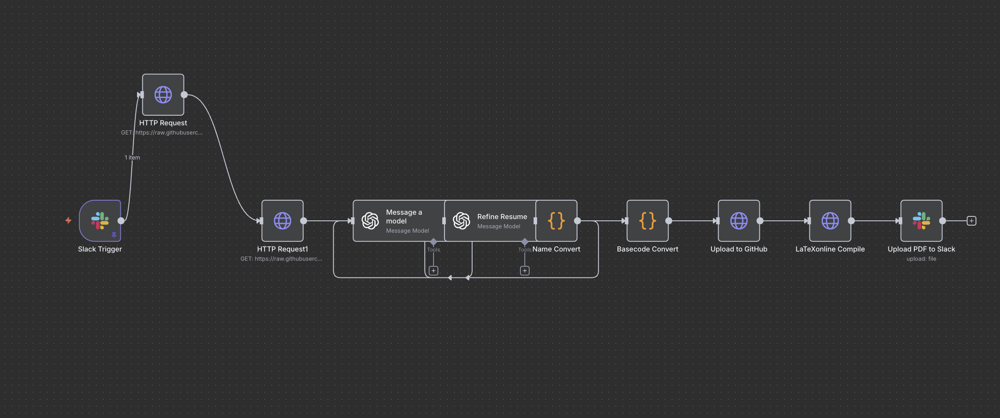

# 🧠 Resume Tailoring Automation (n8n Workflow)

This project automates the **resume tailoring process** using n8n.  
It enables job-specific, metric-driven, ATS-compatible **LaTeX resumes** powered by AI.

---

## 🚀 Features

- **Fully automated flow:** Triggered via Slack, end-to-end automation.
- **LaTeX resume generation:** AI-assisted content creation with PDF output.
- **n8n + OpenAI integration:** Uses prompt engineering and structured JSON master data.
- **GitHub Actions integration:** Automatically uploads and compiles resumes in GitHub.
- **Slack notification:** Sends generated PDF files to a Slack channel.
- **Version control:** Every resume version is tracked as a separate commit.

---

## 🧩 Architecture

Below is a simplified workflow diagram of the process:

```
Slack Trigger → Job Description → OpenAI Prompt → Resume Generator (LaTeX)
   ↓
GitHub Upload → GitHub Actions Build → PDF Output → Slack Notification
```

> ```markdown
> 
> ```

---

## 🏗️ Technologies Used

| Technology         | Description                                                |
| ------------------ | ---------------------------------------------------------- |
| **n8n**            | Automation platform used to orchestrate the workflow.      |
| **OpenAI API**     | Generates resume bullet points and descriptions using GPT. |
| **Slack API**      | Handles triggers and notification delivery.                |
| **GitHub API**     | Manages automatic commits and file uploads.                |
| **LaTeX**          | Produces clean, professional, ATS-compliant resume PDFs.   |
| **GitHub Actions** | Compiles LaTeX files and generates PDFs automatically.     |

---

## ⚙️ Workflow Steps

### 1. Slack Trigger

A Slack command starts the workflow automatically.

### 2. Job Description Parsing

Extracts the job posting text and formats it for the AI prompt.

### 3. OpenAI Processing

GPT model generates resume bullet points following the X–Y–Z formula.

### 4. LaTeX Resume Creation

Outputs a complete LaTeX resume file preserving structure and style.

### 5. GitHub Upload

Automatically commits and pushes `.tex` file to a repository branch.

### 6. PDF Build & Slack Delivery

GitHub Actions compiles LaTeX → PDF and sends it back to Slack.

---

## 🛠️ Setup Guide

> ⚠️ **Important:** Before running the workflow, recreate all credentials securely inside n8n (do not include them in JSON).

### Steps

1. **Install n8n**

   ```bash
   npm install -g n8n
   n8n start
   ```

2. **Import the Workflow**
   In the n8n dashboard, click **Import Workflow** and upload the JSON file.

3. **Create Credentials**

   - OpenAI API Key
   - Slack Bot Token
   - GitHub Personal Access Token

4. **Link Slack Command**
   Connect your custom Slack command (e.g., `/tailor-resume`) to the webhook trigger.

5. **Test It**
   Send a message in Slack to generate a job-specific tailored resume.

---

## 📦 Output Files

- **`resume.tex`** – AI-refined LaTeX resume source file.
- **`resume.pdf`** – Compiled, job-tailored resume PDF.

---

## 📊 Example Usage

1. In Slack, send:

   ```
   /tailor-resume Software Developer @ Nokia Canada
   ```

2. The workflow will:
   - Parse the job description
   - Generate custom bullet points
   - Commit the LaTeX file
   - Deliver the final PDF via Slack

---

## 🧠 Future Enhancements

- ✅ Multiple project weighting
- ✅ Support for Gemini / Claude models
- 🔜 Web dashboard (Supabase + Next.js)
- 🔜 Discord integration
- 🔜 Automatic performance metric extraction

---

## ⚖️ Security Guidelines

- Never commit API keys or tokens directly into JSON files.
- Always use **n8n Credentials** or environment variables.
- Run `git-secrets` or `trufflehog` before pushing commits.
- If credentials were ever exposed, **rotate tokens immediately.**

---

## 👨‍💻 Author

**Muhammed Said Altan**  
Web Developer & Automation Engineer  
🌐 [saidaltan.com](https://saidaltan.com)  
📧 altansaid13@gmail.com  
💼 [LinkedIn](https://www.linkedin.com/in/saidaltan)

---

---

> 💡 Tip: If you plan to share the workflow publicly, remove all sensitive credentials before committing.
